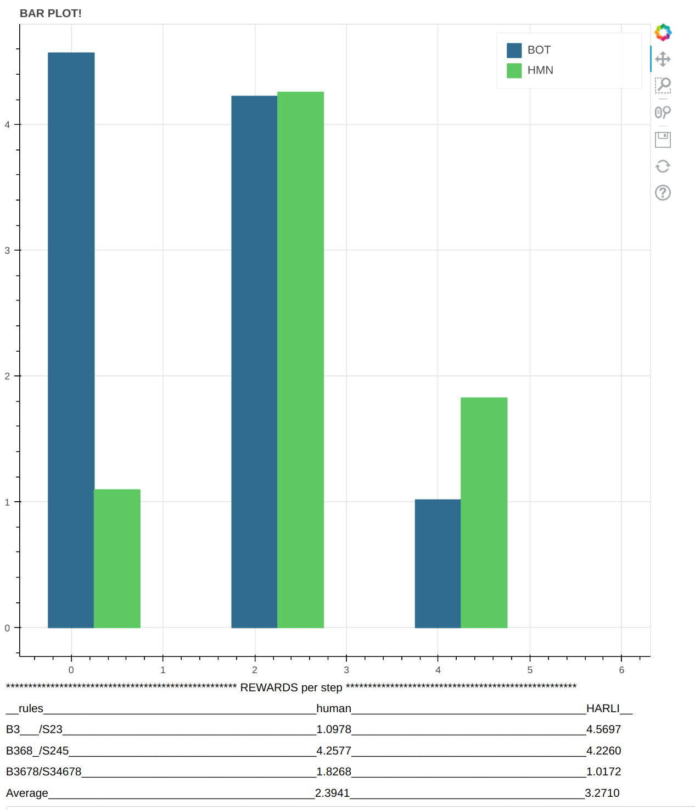

# Can you beat a bot? 

It goes without saying that an optimization agent is going to try to optimize a given objective, whether you like it or not! This project pits you, the human, against an evolved meta-learning cellular automata agent. In a simulation with changing physics and an obscure scoring function, can you figure out the rules of the universe in time to outscore a reward-hacking bot? 

If you wanted to tinker around with CARLE and Carle's Game, but it's too complicated and noever had the time to dive in, here's your latest and simplest entry point. If you do manage to beat the bot, (or not), screenshot the summary scores and bar graph and tweet them @RiveSunder (and maybe add #CarlesGame), or paste your screenshot into an issue at [https://github.com/rivesunder/carles_game](https://github.com/rivesunder/carles_game) to contribute to and be a part of the challenge. More information is available at the challenge [blog](https://rivesunder.github.io/carles_game) or [repo](https://github.com/rivesunder/carles_game).

To accept the challenge click the link below to spin up a mybinder instance:

[https://mybinder.org/v2/gh/riveSunder/human_vs_harli/master?urlpath=/proxy/5006/bokeh-app](https://mybinder.org/v2/gh/riveSunder/human_vs_harli/master?urlpath=/proxy/5006/bokeh-app)

or clone this repository and try out the notebook in notebooks/human_vs_harli.ipynb. In the mybinder app you'll be pitted against a version of an agent called Hebbian Automata Reinforcement Learning Improviser. The play area is a cellular automata universe that cycles through 128 steps of 3 different rule sets, and you'll both have a chance to maximize average reward per step. HARLI takes their turn first, so you get the advantage of seeing their approach before you go. You interact with the environment by clicking on the cells int he central 6 by 6 action space in the observation grid. 

As a human, you have several advantages. HARLI is instantiated with random weights and must adapt them afresh each time the environments changes to a new rule set. You also have the advantage of reward feedback, as you can read the reward scores coming from the environment while the bot cannot (HARLI was selected for achieving high rewards, but never actually sees them). HARLI's main advantage is probably that their neurons are directly tied to the action space, while you will have to click on cells to toggle them. Note that HARLI was evolved on entirely different rule sets than the defaults in this challenge, and in a universe with different dimensions for observations and actions.

I've spent a lot of time staring at cellular automata and working on Carle's Game over the past several months, and I managed to come up with a few pretty good strategies for maximizing the reward from the reward wrapper used in this challenge. I almost beat the bot, maybe you can do better ;)

 

To learn more about your adversary, check out the write up and demo [here](https://github.com/riveSunder/harli_learning).

<em>
Good luck!
</em>

